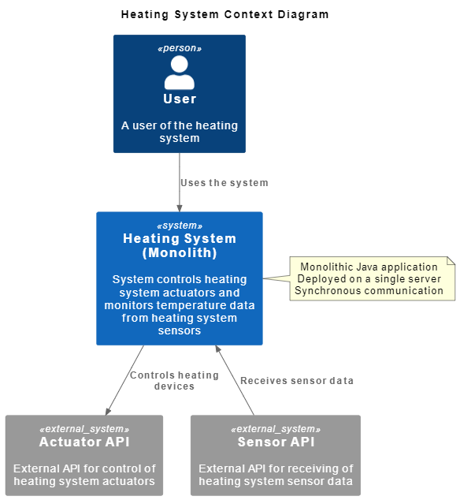
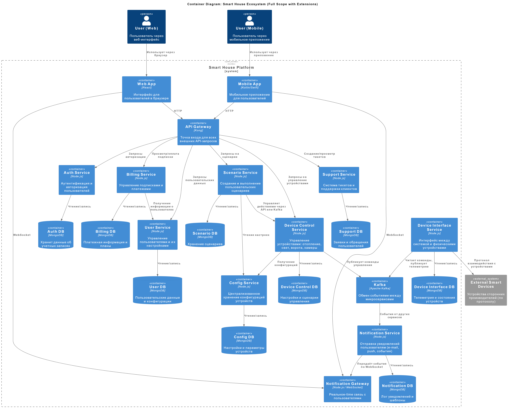

# Project_template

Тип: Материал
Родитель: Описание проекта для 11 когорты (https://www.notion.so/11-03abbbbc8bcb49ed9b85c9b6d1174056?pvs=21)

Это шаблон для решения проектной работы. Структура этого файла повторяет структуру заданий. Заполняйте его по мере работы над решением.

# Задание 1. Анализ и планирование

<aside>
💡

Чтобы составить документ с описанием текущей архитектуры приложения, можно часть информации взять из описания компани и условия задания. Это нормально.

</aside>

### 1. Описание функциональности монолитного приложения

**Управление отоплением:**

- Пользователи могут удалённо включать/выключать отопление в своих домах.
- Установка целевой температуры. Пользователи могут задавать желаемую температуру отопления в доме через веб-интерфейс. Система автоматически регулирует работу отопления для достижения указанной температуры.

**Мониторинг температуры:**
- Система получает данные о температуре с датчиков, установленных в домах.
- Пользователи могут просматривать текущую температуру в своих домах через веб-интерфейс.

### 2. Анализ архитектуры монолитного приложения

- **Язык программирования**: Java
- **База данных**: PostgreSQL
- **Архитектура**: Монолитная, все компоненты системы (обработка запросов, бизнес-логика, работа с данными) находятся в рамках одного приложения.
- **Взаимодействие**: Синхронное, запросы обрабатываются последовательно.
- **Масштабируемость**: Ограничена, так как монолит сложно масштабировать по частям.
- **Развёртывание**: Требует остановки всего приложения.

### 3. Определение доменов и границы контекстов

**1. Домен: Управление системой отопления**
Поддомены:
  - Выбор отопительной системы по идентификатору
  - Включение/выключение отопления
  - Установка целевой температуры
  - Визуальный интерфейс управления отоплением

**2. Домен: Мониторинг температуры**
Поддомены:
  - Выбор отопительной системы по идентификатору
  - Обработка собираемых данных о температуре
  - Визуальный интерфейс мониторинга температуры

### **4. Проблемы монолитного решения**

- **Высокая связанность компонентов (High Coupling)**
В монолите все части системы тесно связаны между собой. Это означает, что сбой в одном модуле может привести к отказу всей системы. Таким образом, монолит — это единая точка отказа (Single Point of Failure).

- **Сложность с выпуском обновлений**
Чтобы внести изменения или развернуть новую функциональность, необходимо пересобрать и заново развернуть всё приложение. Это затрудняет быстрые и независимые релизы.

- **Высокий риск ошибок**
Любые изменения в одной части приложения могут неожиданно повлиять на другие модули. Это увеличивает вероятность появления багов и требует полного регрессионного тестирования перед каждым релизом.

- **Длительные циклы разработки и тестирования**
Из-за общей кодовой базы приходится тестировать всё приложение даже при изменениях в одной небольшой части. Это замедляет разработку и выпуск новых функций, что критично в условиях роста конкуренции и новых требований от заказчика.

- **Трудности в командной работе**
Когда несколько команд работают с одним монолитом, это вызывает конфликты при слиянии кода, блокировки задач и задержки. Изменения одной команды могут затруднить работу другой.

- **Невозможность масштабирования отдельных компонентов**
В случае повышения нагрузки, например, на подсистему мониторинга или управления отоплением, невозможно масштабировать только её. Необходимо масштабировать всё приложение целиком, что неэффективно и дорого.

- **Ограниченная гибкость при расширении функциональности**
Переход к новой архитектуре с модульными комплектами и управлением умными устройствами требует гибкости. Монолит не позволяет быстро и изолированно добавлять новые модули (например, управление освещением, видеонаблюдение, сценарии автоматизации).

### 5. Визуализация контекста системы — диаграмма С4

[Диаграмма контекста в модели C4](c4\as-is\context.pulm)

# Задание 2. Проектирование микросервисной архитектуры

В этом задании вам нужно предоставить только диаграммы в модели C4. Мы не просим вас отдельно описывать получившиеся микросервисы и то, как вы определили взаимодействия между компонентами To-Be системы. Если вы правильно подготовите диаграммы C4, они и так это покажут.

**Диаграмма контейнеров (Containers)**

[Диаграмма контейнеров в модели C4](c4\to-be\container.pulm)

**Диаграмма компонентов (Components)**

Добавьте диаграмму для каждого из выделенных микросервисов.

**Диаграмма кода (Code)**

Добавьте одну диаграмму или несколько.

# Задание 3. Разработка ER-диаграммы

Добавьте сюда ER-диаграмму. Она должна отражать ключевые сущности системы, их атрибуты и тип связей между ними.

Четвёртое задание — дополнительное. Его можно сделать по желанию. Чтобы ревьюер быстрее проверил ваше решение, укажите, сделали вы это задание или нет. Для этого оставьте нужный эмодзи около заголовка задания:

✅ — вы выполнили задание.

❌ — вы пропустили задание.

# ✅ ❌ Задание 4. Создание и документирование API

### 1. Тип API

Укажите, какой тип API вы будете использовать для взаимодействия микросервисов. Объясните своё решение.

### 2. Документация API

Здесь приложите ссылки на документацию API для микросервисов, которые вы спроектировали в первой части проектной работы. Для документирования используйте Swagger/OpenAPI или AsyncAPI.